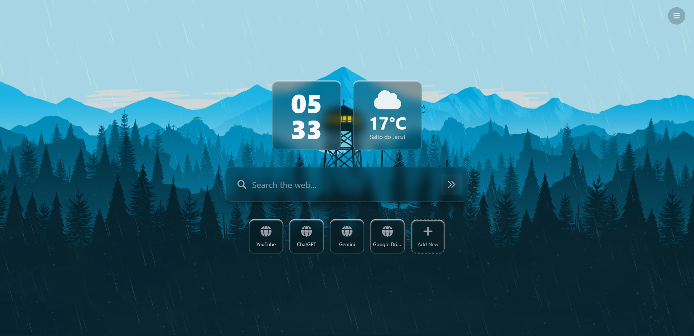
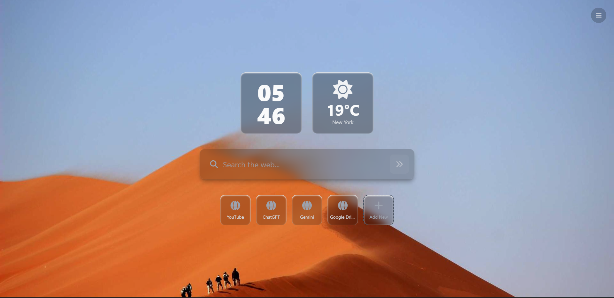
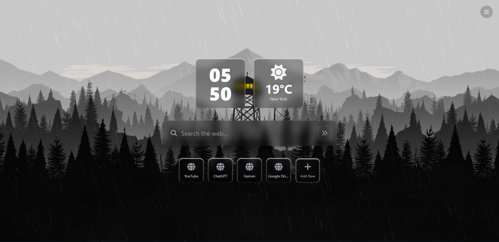

<h1 align="center">EsthevanSearch</h1>

A clean homepage. No distractions. No tracking. No clutter. 
A minimal front-end project that simply works.

  
  
  

## About

Tired of browsers pushing ads, irrelevant news, pop-ups, and banners?  
I was too. So I built EsthevanSearch.  

A simple startpage that shows only what matters:  
- Time  
- Weather  
- Search  
- Useful shortcuts  

Fast, lightweight, and distraction-free.

## Technologies

  

- React + TypeScript  
- Tailwind CSS  
- Vite  
- OpenWeather API  

No unnecessary dependencies.  
No shady scripts.  
No bloated plugins.  

## Features

- Current time  
- Real-time weather  
- Functional search bar  
- Useful shortcuts  
- Responsive and lightweight layout  

## License

MIT  
Use it, modify it, ignore it.  
Just don’t make it ugly.
